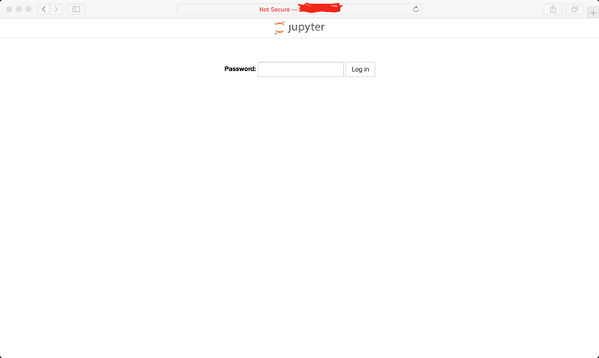
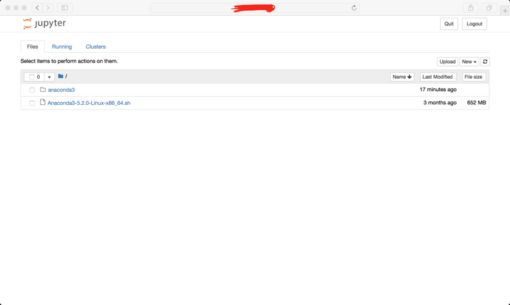

# Ubuntu with CUDA Support
   
This Dockerfile could build the image with **Ubuntu16.04 + CUDA9.0**. It also supports remote login by using SSH. 
## Requirements
- [Docker-CE](https://docs.docker.com/install/linux/docker-ce/ubuntu/)
- [Nvidia-Docker](https://github.com/NVIDIA/nvidia-docker)
## Instruction to build the image
```bash
sudo docker build -t your_repo/image_name:tag_idx /your/docker_folder/
```
or just pull it from my DockerHub
```bash
sudo docker pull tianhongdai/ubuntu-cuda:9.0
```
after the above steps you could check your images by using
```bash
sudo docker images
```
and you should see
```bash
tianhong@blackmanba ~ $ sudo docker images
REPOSITORY                TAG                    IMAGE ID            CREATED             SIZE
tianhongdai/ubuntu-cuda   9.0                    06a5a4e73980        38 minutes ago      254MB
nvidia/cuda               latest                 e2728e6295c6        8 weeks ago         1.96GB

```
## How to create your container and use SSH to login
1. create the container
```bash
sudo nvidia-docker run -dP -p 8888:8888 --name tianhong tianhongdai/ubuntu-cuda:9.0

```
then, you could check your containers
```bash
tianhong@blackmanba ~ $ sudo nvidia-docker run -dP -p 8888:8888 --name tianhong tianhongdai/ubuntu-cuda:9.0
f36c79136612954f6733f12341ec68425555404a09a81d2c6e072d6e8bf0e719
tianhong@blackmanba ~ $ sudo docker ps
CONTAINER ID        IMAGE                         COMMAND               CREATED             STATUS              PORTS                                           NAMES
f36c79136612        tianhongdai/ubuntu-cuda:9.0   "/usr/sbin/sshd -D"   8 seconds ago       Up 6 seconds        0.0.0.0:8888->8888/tcp, 0.0.0.0:32779->22/tcp   tianhong
tianhong@blackmanba ~ $
```
2. login to the container
finally, you can login on your container by using SSH, the default password is `password`
```bash
ssh -p <your port number: 32779 in this case> root@<your server machine ip address>
```
check if you can see the GPU
```bash
root@f36c79136612:~# nvidia-smi
Sat Aug 25 12:33:04 2018
+-----------------------------------------------------------------------------+
| NVIDIA-SMI 384.130                Driver Version: 384.130                   |
|-------------------------------+----------------------+----------------------+
| GPU  Name        Persistence-M| Bus-Id        Disp.A | Volatile Uncorr. ECC |
| Fan  Temp  Perf  Pwr:Usage/Cap|         Memory-Usage | GPU-Util  Compute M. |
|===============================+======================+======================|
|   0  GeForce GTX 108...  Off  | 00000000:01:00.0  On |                  N/A |
| 21%   36C    P8    15W / 250W |    363MiB / 11169MiB |     22%      Default |
+-------------------------------+----------------------+----------------------+

+-----------------------------------------------------------------------------+
| Processes:                                                       GPU Memory |
|  GPU       PID   Type   Process name                             Usage      |
|=============================================================================|
+-----------------------------------------------------------------------------+
root@f36c79136612:~#

```
## How to use jupyter-notebook on your local machine by using container
1. download and install the anaconda(I prefer to use anaconda, you can also install the native python)
```bash 
# download
wget https://repo.anaconda.com/archive/Anaconda3-5.2.0-Linux-x86_64.sh
# install anaconda
bash Anaconda3-5.2.0-Linux-x86_64.sh

```
make sure the environment variable has been added to the `~/.bashrc`, then execute the following command to make it work
```bash
source ~/.bashrc
```
2. configure the jupyter notebook
```bash
root@f36c79136612:~# python
Python 3.6.5 |Anaconda, Inc.| (default, Apr 29 2018, 16:14:56)
[GCC 7.2.0] on linux
Type "help", "copyright", "credits" or "license" for more information.
>>> from notebook.auth import passwd
>>> passwd()
Enter password:
Verify password:
'sha1:e557db47fba9:4cc97259dafcacxxxxxxb9f17978ab41a1d3'
>>>
```
then, we need to generate the configure file
```bash
jupyter notebook --generate-config
```
open the configure files
```bash
vim ~/.jupyter/jupyter_notebook_config.py
```
add the following content in the end of file
```bash
c.NotebookApp.ip = '*'
c.NotebookApp.password = u'sha1:e557db47fba9:4cc97259dafcacxxxxxxb9f17978ab41a1d3(should be your generated key)'
c.NotebookApp.open_browser = False
c.NotebookApp.port = 8888
```
3. start the jupyter notebook
```bash
jupyter notebook --allow-root
```
4. use jupyter on your local machine
now open your browser, and enter `<your server machine ip address>:8888`

enter the password you set above and you can use the jupyter notebook

